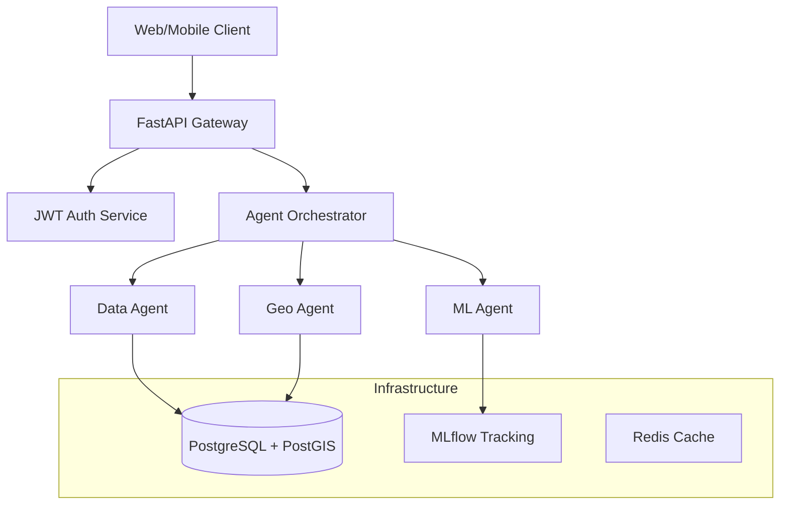

# 🚀 AstroGeo AI - Enterprise MLOps Platform

[](LICENSE)
[](https://www.python.org/downloads/)
[](https://fastapi.tiangolo.com/)
[](https://www.docker.com/)

**Production-ready MLOps platform combining Agentic AI, Geospatial Analytics, and Modern ML Infrastructure.**

---

## 📖 Welcome to AstroGeo AI!

Hi there! If you're new to this project, here's the "elevator pitch": AstroGeo AI is a sophisticated backend platform designed to handle complex tasks that involve **Location Data (Geospatial)** and **Artificial Intelligence**. 

Imagine needing to analyze satellite imagery, predict weather patterns for specific coordinates, and then have an AI "agent" write a report about it—that's what this system is built to orchestrate.

---

## 📋 Table of Contents
- [✨ Key Features](#-key-features)
- [🚦 Current Project Status](#-current-project-status)
- [✅ What's Already Done](#-whats-already-done)
- [🚧 What's Still Remaining](#-whats-still-remaining)
- [🏗️ Architecture](#-architecture)
- [📂 Project Structure](#-project-structure)
- [🚀 Quick Start (For Developers)](#-quick-start-for-developers)

---

## ✨ Key Features

- 🤖 **Agentic AI**: Multi-agent system (Data, Geo, and ML agents) that can decompose complex user requests into smaller tasks.
- 🌍 **Geospatial Intelligence**: Built-in support for PostGIS, allowing for advanced spatial queries (finding things within a radius, calculating distances, etc.).
- 🔬 **MLOps Excellence**: Integrated with MLflow for experiment tracking and DVC for data versioning.
- ⚡ **High Performance**: Built with FastAPI for asynchronous, non-blocking API endpoints.
- 🚢 **Cloud Ready**: Complete Kubernetes (EKS) manifests and Docker support for production deployment.

---

## 🚦 Current Project Status

**Status**: 🏗️ **Functional Backend Prototype**

The project has a very solid architectural foundation. All the "plumbing" (database connections, API routes, authentication, agent orchestration logic) is **complete**. 

The system is currently in a state where it can be demonstrated using "mock" (simulated) data for the AI agents, while the core infrastructure is fully production-grade.

---

## ✅ What's Already Done

We have successfully implemented the following core components:

### 1. 💾 Database Layer (100% Complete)
- **Advanced Models**: Support for Users, Geospatial Locations (PostGIS), ML Models, Predictions, and Agent Execution logs.
- **Async Connections**: High-performance asynchronous database management using SQLAlchemy and `asyncpg`.
- **Migrations**: Fully set up with Alembic for easy database schema updates.

### 2. 🔌 API Layer & Security
- **Comprehensive Routes**: Endpoints for Agent execution, System Health monitoring, and Administrative tasks.
- **JWT Authentication**: Secure user login and role-based access control (Admin vs. Regular User).
- **Auto-Docs**: Interactive Swagger/OpenAPI documentation is automatically generated.

### 3. 🧠 AI Orchestration
- **The Brain**: An `AgentOrchestrator` that knows how to pick the right "agent" for a job.
- **Task Decomposition**: Ability to break one big request into multiple steps for Data, ML, and Geo agents.

---

## 🚧 What's Still Remaining

To move from a prototype to a full production system, the following tasks are on the roadmap:

1. **Replace Mock Logic**: The "Data", "Geo", and "ML" agents currently return simulated data. We need to plug in real logic:
    - **DataAgent**: Integrate real Pandas/SQL processing.
    - **GeoAgent**: Integrate real `geopy` and `geopandas` calculations.
    - **MLAgent**: Connect to real Scikit-learn/TensorFlow training scripts.
2. **Frontend UI**: Currently, the project is purely a backend API. A dashboard for interacting with agents and viewing predictions is needed.
3. **Data Population**: Filling the geospatial database with more real-world datasets for testing.

---

## 🏗️ Architecture



---

## 📂 Project Structure

- `src/api/`: All the API "doors" (routes) and the main application entry point.
- `src/agents/`: The logic for our AI agents and the orchestrator.
- `src/database/`: Where our data models and connection logic live.
- `src/schemas/`: The "contracts" for how data should look when coming in or going out.
- `src/services/`: Specific business logic (e.g., how to handle uploads or predictions).
- `k8s/`: Settings for running the app on Kubernetes (Cloud).
- `docker-compose.yaml`: The "easy button" to start all databases and services locally.

---

## 🚀 Quick Start (For Developers)

### 1. Prerequisites
- Docker & Docker Desktop
- Python 3.10+

### 2. Setup
```bash
# 1. Start the databases (Postgres, Redis, MLflow)
docker-compose up -d

# 2. Setup your environment
cp .env.example .env
# (Edit .env with your keys if needed)

# 3. Apply database migrations
alembic upgrade head

# 4. Start the API
uvicorn src.api.main:app --reload
```

### 3. Explore
Once running, go to: **[http://localhost:8000/docs](http://localhost:8000/docs)** to see the interactive API documentation and try out the endpoints!

---

**Built with ❤️ for the future of Geospatial AI**
